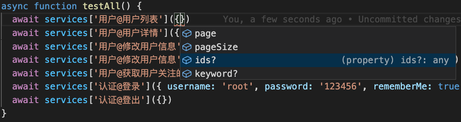

# Yapi to Services(根据 yapi 配置生成前端 api 请求相关的 services 文件)

If you wish to standardify the frontend api request, or change less code when api changes, or get smart ide intellisense, you may try this project.

- `y2s` collect all api arguments into one object, you don't need to care where(`querystring` or `params` or `body`) the argument in
- `y2s` support `typescript` default, and it also provide `d.ts` for js project which means you can also get ide intellisense
- Just `y2s update -y` when the `yapi` changed

如果你希望统一前端 api 请求，如果你希望减少 api 变更对于代码的变更，如果你希望获得更好的 api 请求的参数和返回结构体的提示，那么请试试本项目。

- `y2s`将所有的接口参数全部揉合在一个对象里，你不需要关心它在`querystring`上，还是`params`上，还是`body`里，你全部塞到一个对象里即可
- `y2s`默认对`typescript`友好，对 js 项目也有智能提示
- `yapi`接口变动时你只需要执行一下`y2s update -y`即可

## Install 安装

```shell
# yarn
yarn add -D y2s
# or npm
npm i --save-dev y2s
# or yarn global
yarn global add y2s
# or npm global
npm i -g y2s
```

## Initialize 初始化

```shell
# print help message
y2s help
# initialize .y2src.js config file 这将会在根目录生成一个.y2src.js的配置文件，请在这里修改为你的yapi项目的相关配置
y2s init
```

## Configuration 配置

Please update the `.y2src.js` config file after initialize 修改`.y2src.js`配置文件的内容

```js
module.exports = {
  // yapi prefix yapi地址前缀
  apiPrefix: 'https://yapi.your.company',
  // yapi project's token yapi的项目token
  token: 'token',
  // yapi projects's id yapi的项目id
  projectId: 12,
  // [Optional, default: 'src/services'] folder to save service files 生成的service相关文件的存储位置
  outputPath: 'src/services',
  // [Optional, default: false] wether to save the origin yapi api json response to file 是否保存api.json文件
  saveJson: true,
}
```

## Generate service files 生成 service 相关文件

```shell
# this will generate yapi.api.d.ts, yapi.apis.ts, yapi.services.ts files in 'outputPath' folder which defined in '.y2src.js' file
# 该命令将会在'.y2src.js'配置中的'outputPath'目录下生成service的相关文件
y2s update [-y] [--js]
```

## Impletement your request function 实现 api 请求的真正内容

The generated service files are just http request wrapper, you need impletement the request function yourself according to your project and `ajax` library. Here is the `axios` example.
我们生成的 service 的相关文件本身只是一个包装层，而真正的请求怎么去发需要自行实现，这取决与你的项目本身以及项目中使用的`ajax`相关的第三方库。这里有一个`axios`的示例写法。

```typescript
//# src/services/index.ts
import axios from 'axios'
import { Method, RequestBody, RequestQuery } from './yapi.api'
import { createServices } from './yapi.services'

const token = localStorage.getItem('token')
const services = createServices(
  async (url: string, method: Method, query: RequestQuery, body: RequestBody, done = true) => {
    const { status, data, statusText } = await axios.request({
      url,
      method,
      // When api finished using the real api or using the mock api
      baseURL: done ? 'https://your.api.com/v1' : 'https://mock.your.api.com/v1',
      params: query,
      data: body,
      responseType: 'json',
      headers: token
        ? {
            Authorization: `Bearer ${token}`,
          }
        : {},
    })
    if (status < 300 && status >= 200) {
      return {
        error: false,
        data: data,
      }
    }
    return {
      error: true,
      data: null,
      message: statusText,
    }
  }
)
export default services
```

## Usage 用法

Then you can use like this 那么就可以这么使用

```typescript
import services from '@/services'

async function doRequest() {
  const { error, data } = await services['group@api_title']({ ...args })
  return error ? [] : data.items
}
```

There is a field named `_body` in the request arguments which is a fallback way to avoid duplicated key in body and querystring/params, when passing `_body` the request body will be the `_body` value.
在参数里有一个`_body`参数，这是为了防止 body 和 querystring/params 存在重复 key 的情况，当使用`_body`时，那么真实请求的 body 内容将是`_body`的值。

## Screenshot 使用截图

service argument tips 请求参数提示


service response tips 请求结果提示

